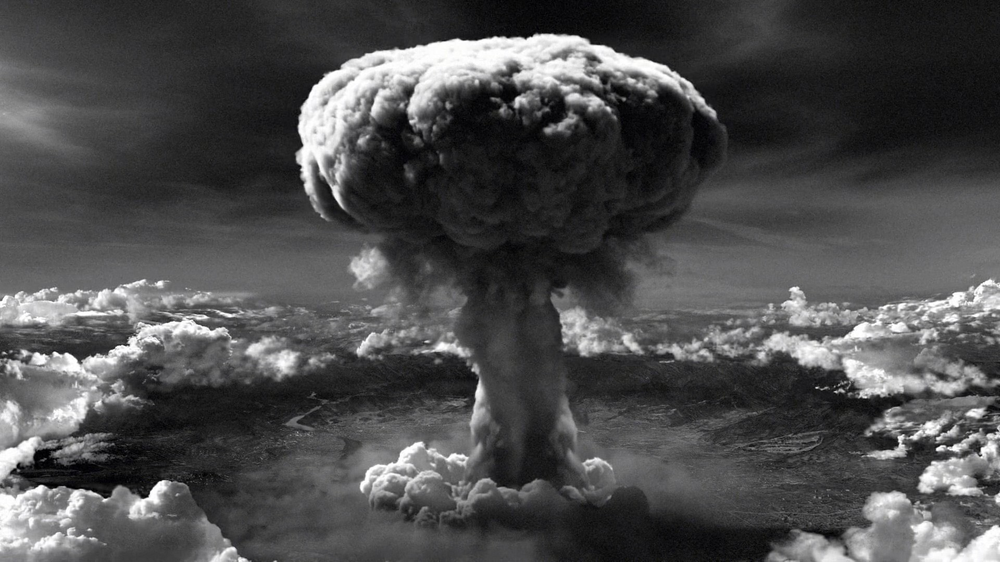
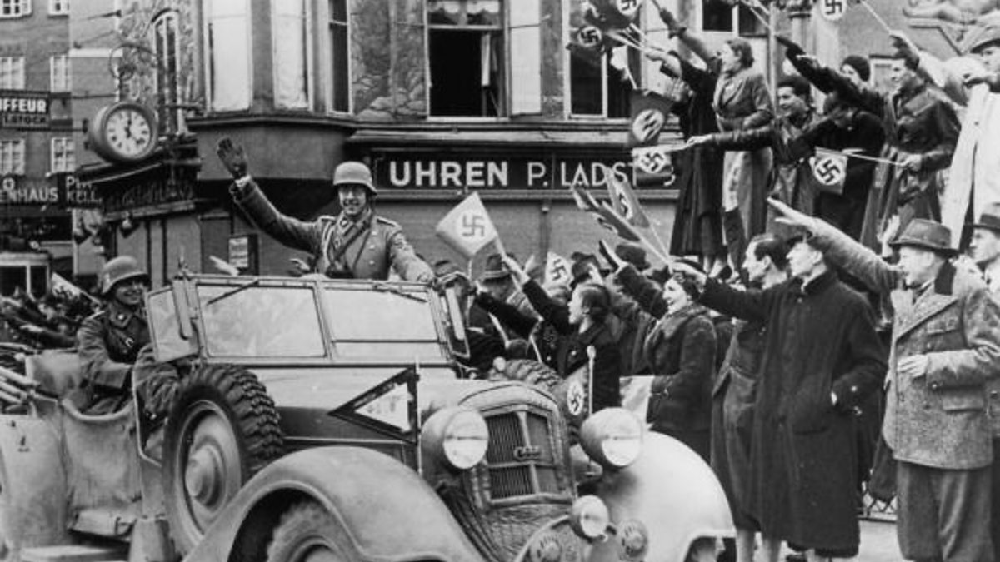

Genesis
=======

Introduction
------------

World War II - the largest armed conflict in the history of the world, lasting from September 1, 1939 to September 2, 1945 (in Europe until May 8, 1945), covering almost all of Europe, eastern and southeastern Asia, northern Africa, and part of the Middle East. and all oceans. Some episodes of the war even took place in the Arctic and North America. In addition to almost all European countries, the main countries of North America and South America, Australia and Asia took part. The main parties to the conflict were the Axis powers and the anti-Hitler coalition countries (Allies).

The date the war started
~~~~~~~~~~~~~~~~~~~~~~~~

The date of the beginning of the war is assumed to be September 1, 1939 - the German attack on Poland, on September 3, 1939, as a result of the expiry of the ultimatum, Great Britain and France entered the war at 11 a.m. British summer time (in Western literature, the latter date is sometimes given as the beginning of the war). world war). Some people consider the beginning of the world war to be the Japanese-Chinese war, which began on July 7, 1937 with the invasion of Japanese troops, but until 1941 the conflict remained local. In Soviet historiography, there was the concept of the Great Patriotic War, starting on June 22, 1941 with the German attack on the USSR. For Americans, the war began on December 7, 1941, with the Japanese attack.

An announcement of the upcoming conflict
----------------------------------------

The foreshadowing of the coming conflict was the increase in nationalist sentiments and expansionist aspirations on the part of the Axis powers, expressed in the attack of fascist Italy on Abyssinia (Italo-Abyssinian War 1935-1936), the Sino-Japanese war lasting since 1937 (which some historians consider to be part of World War II ) and the partition of Czechoslovakia (October 1938). A bloody civil war had been going on in Spain since 1936, in which the intervening fascist states and the communist USSR clashed. World War II was also preceded by such aggressive behavior on the part of the Third Reich, such as the occupation of the Rhineland in 1936, the Anschluss of Austria (March 1938 - March 1939) and the annexation of Klaipeda and the Czech Republic. On the part of Italy, an example of a violation of international law was the occupation of Albania in the spring of 1939.

Course
======

War outbreak
------------

The war broke out on September 1, 1939 after the attack of the Third German Reich in agreement with the USSR on Poland. The first stage of the war, called the Polish Defensive War or, traditionally in the literature, the September Campaign, began with aggression against the city of Wieluń and along the entire German-Polish border in accordance with the "Fall Weiss" directives.

"Fall Weiss"
	codename of the strategic plan for the war with Poland, prepared by the German army (Wehrmacht) headquarters in 1939.

Alliances existing before the outbreak of the war
~~~~~~~~~~~~~~~~~~~~~~~~~~~~~~~~~~~~~~~~~~~~~~~~~

At the outbreak of the war, Poland had an alliance agreement with France of 1921, an alliance agreement with Great Britain of August 25, 1939, and an alliance with Romania, which was valid only in the event of an attack by the USSR. Germany was bound by the Anti-Comintern Pact with Japan and Italy, the so-called the Steel Pact with Italy and the agreement with the USSR (Ribbentrop-Molotov Pact) of August 23, 1939, which de facto divided Central Europe into zones of influence of both countries and gave Germany a free hand in the war with Poland. Formally, the war took on a global character when Great Britain and France declared it on September 3, 1939. Together with Great Britain, India and the main countries of the British Commonwealth (British dominions) joined the war: Australia and New Zealand (September 3), United Arab Emirates (September 6). and Canada (September 10). However, neither Italy nor Japan officially joined the war on Germany's side at this stage. Hungary and Romania remained neutral. Together with the Germans, the Slovak Field Army "Bernolak" moved against Poland, and on September 17, the Red Army attacked Poland without any declaration of war specified in international law.
.. In fact, despite Poland's alliance with Great Britain and France, none of these countries wanted to help Poland defend itself against the aggressors.

Pact Ribbentrop-Mołotow
	 international agreement of August 23, 1939, which was formally a non-aggression pact between the Third Reich and the Union of Soviet Socialist Republics, which, in accordance with a secret additional protocol constituting an annex to the official document of the agreement, concerned the partition of territories or the regulation of the independence of sovereign states: Poland, Lithuania, Latvia , Estonia, Finland and Romania. It is also sometimes referred to as the 4th partition of Poland.

Soviet aggression against Poland 1939.
~~~~~~~~~~~~~~~~~~~~~~~~~~~~~~~~~~~~~~

September 17, 1939, the Red Army crosses the Polish border
Heinz Guderian and Semyon Krivoshein receive the Soviet-German parade in Brest

Poland's military defeat
~~~~~~~~~~~~~~~~~~~~~~~~

The aggression of the USSR resulted in Poland's military defeat in the campaign. The USSR occupied the territory of the Republic of Poland up to the line of the Molotov-Ribbentrop Pact. This attack broke the Polish-Soviet non-aggression pact of 1932, which was to remain in force until 1945, but it did not trigger a declaration of war from the Polish government. The USSR, in a note presented on the night of September 17, 1939 - at the beginning of the aggression - to the Polish ambassador in Moscow, Wacław Grzybowski, unilaterally stated the cessation of the existence of the Polish state. The ambassador refused to accept the note, and Polish diplomats left the territory of the USSR only after the intervention of the dean of the diplomatic corps, Reich ambassador von Schulenburg. The September Campaign ended when German and Soviet troops occupied Polish territory and the resistance of Polish troops (regular army) in the country ended.

The course of the fighting
--------------------------

The Red Army fought with the Border Protection Corps along the entire border line. Polish Army units and volunteers fought hard in defense of Grodno. The lack of a formal public announcement by the President and the government of the Republic of Poland of the existence of a state of war between the USSR and Poland and the lack of a clear order from the Commander-in-Chief to resist the invader led to confusion among commanders and soldiers (see Defense of Lviv 1939) and, consequently, to the capture of approximately 250,000 soldiers. and officers, most of whom did not resist.

Evacuation of the Polish government
~~~~~~~~~~~~~~~~~~~~~~~~~~~~~~~~~~~

After the Soviet aggression, the Polish government evacuated on the night of September 17, 1939 to the territory of allied Romania. Despite the Polish-Romanian agreement on free passage (French: droit de passage), under German-Soviet pressure, and with the agreement of the Romanians with the French government (ambassador Leon Noël), the Polish government was interned without notice. On September 30, 1939, President Ignacy Mościcki, using the prerogatives of the constitution regarding the possibility of appointing a successor during the war, issued a decree transferring power to Władysław Raczkiewicz, which initiated the activities of the Polish Government in exile.

The beginning of repression 
~~~~~~~~~~~~~~~~~~~~~~~~~~~

The inhabitants of both occupied parts of Poland were subjected to repression by the occupiers. In September 1939, the structures of the underground state subordinated to the Government of the Republic of Poland in exile began their activities. The state continuity of the Republic of Poland in the international arena has been preserved, despite the declarations of the aggressors and occupiers. The underground administration and the underground Polish Army were recreated in the occupied country.
.. The government-in-exile operated dynamically in London despite the occupation.

Allied passivity
~~~~~~~~~~~~~~~~

Meanwhile, in the West, the so-called a strange war, because the Allies did not take offensive actions. At the meeting of the Allied Supreme Council in Abbeville on September 12, 1939, France and Great Britain decided not to provide Poland with real military assistance. On September 28, 1939, in the pact on borders and friendship concluded in Moscow, the Third Reich and the USSR, contrary to international law (Hague Convention IV of 1907), demarcated the German-Soviet border on the military-occupied territory of Poland. However, in relation to the provisions of the secret protocol to the Molotov-Ribbentrop Pact, the two aggressors made some modifications: the USSR gave the territory of the Lublin region to the Third Reich in exchange for Germany's consent to subordinate the USSR to Lithuania. The Vilnius region was transferred to Lithuania on October 10 in exchange for consent to Red Army bases on its territory. The USSR forced similar agreements on Estonia and Latvia on September 29 and October 5. Until June 1940, these countries still enjoyed the appearance of independence. From November 30, 1939 to March 13, 1940, there was a war between the USSR and Finland, the so-called the Winter War, caused by the attack of the USSR due to Finland's refusal to conclude a similar treaty on Soviet bases.

Events:
-------
1) Dropping atomic bombs on Hiroshima and Nagasaki - 6 and 9/08/45
2) Capitulation of Warsaw - September 28, 1939
3) German attack on the USSR - June 22, 1941
4) Battle in the Wizna area – September 7-10, 1939. A number of shelters were built for defense:
	a) Giełczyn-Kołodzieje – 3 heavy combat shelters,
	b) Góra Strękowa – 2 heavy combat shelters,
	c) Kurpiki – 1 heavy combat shelter,
5) Battle of Britain - July 10 to October 31, 1940
6) Battle of Kock - October 2 to 5, 1939
7) Italian aggression against Greece – October 28, 1940 – April 23, 1941
8) USSR attack on Poland - September 17, 1939
	a) The commander leading the attack on Poland was Mikhail Kovalev. His forces consisted of:
		a) 600,000–800,000 soldiers,
		b) 4 736 tanks,
		c) 3 300 planes
	b) losses on the Polish side ranged from 3,000–7,000 dead
	c) on the Russian side from 1,475–3,000 killed and missing,

9) Battle of El-Alamein - First Battle of Alamein in July 1942
10) Second Battle of El Alamein in October-November 1942. 
11) Attack on Westerplatte - September 1-7, 1939 
12) Japanese attack on Pearl Harbor - December 7, 1941

Who were:
---------

#. Tadeusz Kutrzeba - captain of the General Staff of the Imperial and Royal Army, division general of the Polish army of the Second Polish Republic, commander of the "Poznań" Army. World War I, Polish-Bolshevik War, World War II, September Campaign, Battle of the Bzura
#. Franciszek Kleeberg - brigadier general of the Polish Army. Commander of SGO Polesie. World War I, Polish-Bolshevik War, World War II, September Campaign, Battle of Kock
#. Henryk Sucharski - Polish military commander, major of the Polish Army. He defended Westerplatte. World War I, Polish-Bolshevik War, World War II, September Campaign.
#. Franciszek Dąbrowski - lieutenant commander of the Navy, during the Polish defensive war in 1939, deputy commander, most of the time also the actual commander of the defense of the Military Transit Depot at Westerplatte.

Concepts:
---------

- Molotov-Ribbentrop Pact - a non-aggression pact concluded between the Third Reich and the USSR in Moscow on August 23, 1939. It concerned, among others, the regulation of the sovereignty of Poland, Lithuania and Latvia.
- strange war - a definition of the initial period of World War II lasting from September 1, 1939 to May 10, 1940.
	- The countries allied with Poland (France, Great Britain) did not take any military action after declaring war on the Third Reich on September 3, 1939, despite the provisions in the agreements, thanks to which Adolf Hitler could freely continue the offensive against Poland without opening a second front.
- Winter War - armed conflict between the USSR and Finland, taking place from November 30, 1939 to March 13, 1940. The Winter War exposed all the weak points of the Red Army, which suffered very high losses. The USSR's aggression was met with international condemnation, as a result of which the USSR was excluded from the League of Nations. Finland, despite losing part of its territory[4], managed to defend its independence.
- Atlantic Charter - an eight-point declaration signed on board the ship HMS Prince of Wales. It defined the policy goals of Great Britain and the USA during and after World War II as well as the principles of post-war international relations.
- Battle of the Atlantic - the longest campaign of World War II fought in the Atlantic Ocean and its seas; lasted from September 3, 1939 to the capitulation of Germany in May 1945

Before war
==========

Before World War II
-------------------

The reasons for the conflict were related to the crisis of the democratic-liberal system in European countries and the growth of authoritarian tendencies after the end of World War I, turning into totalitarian systems (including fascism in Italy, national socialism in Germany, communism in the USSR). The demands for a revision of the arrangements of the Versailles order (Versailles Peace Treaty of 1919) put forward by the Germans created a constant threat to the peace agreement in Europe, and the growing territorial aspirations of the USSR and Japan in East Asia complicated the situation in that region of the world. Imperial and nationalist tendencies, supported by ideological doctrines, striving to change the political, economic and social order in the world, created a common ground of understanding between countries such as Germany, Japan, Italy, and later also the USSR. The events preceding World War II caused a constant threat to the Versailles order. : annexation of Abyssinia by Italy (1936, Italo-Abyssinian War 1935-1936), demilitarization of the Rhineland (1936), Anschluss of Austria (1938), Munich Conference (1938), annexation of the Czech Republic by Germany (1939) and Albania by Italy (1939), the conflict between China and Japan (1932-1933 and from 1937), the conflict between Japan and the USSR (1939), and finally the Soviet-German agreement (Ribbentrop-Molotov Pact), which determined the possibility of implementing the next stage of Nazi Germany's policy.

	Anschluss of Austria (1938)
